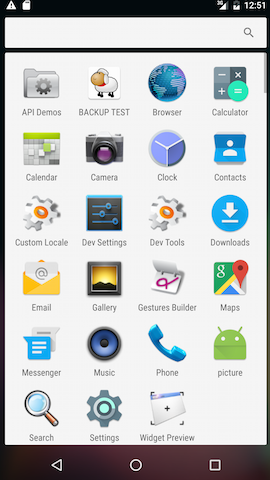
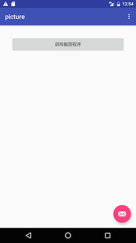
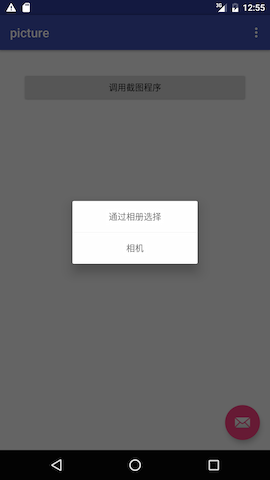
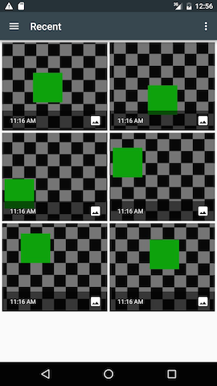
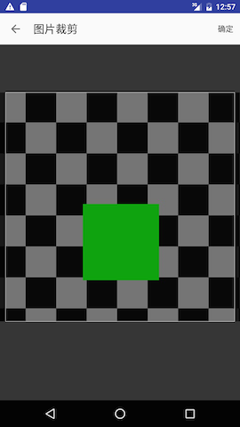
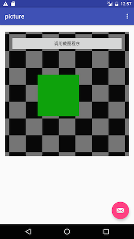

# PictureCroppingTool

> 单个图片选择和裁剪，一般用于头像选择和裁剪。

## 本例所采用思路：
* 相册选择：把图片的路径封装成 uri 对象的方式，进行不同Activity 之间的传递，比如从 galley-》pictureCropperActivity。
* 相机拍照选择：相机在调用的时候设置输出路径，拿到路径，也是封装 Uri 对象，进行不同的 activity 之间的传递。
* 通过 Uri 对象，避免 传递的过程中出现 oom 的问题。

## 使用方式
* 当前的Activity继承 
```java
 public class MainActivity extends PictureBaseActivity{
 //..... todo
 }
```
* 点击调用 
```java
showChoiceDialog();
```
* 重写：
``` java
  @Override
    public void onCompressed(Uri uri) {
        super.onCompressed(uri);
        //tudo

    }

    @Override
    public void onPictureCropped(Uri uri) {
        super.onPictureCropped(uri);
        //uri methods : getpath() etc.
        mImageView.setImageBitmap(BitmapUtil.decodeUriAsBitmap(this, uri));
    }
```
* 所需权限
```xml
   <uses-feature
        android:name="android.hardware.camera"
        android:required="true" />

    <uses-permission android:name="android.permission.WRITE_EXTERNAL_STORAGE" />
```
* 清单文件注册
```xml
   <activity
            android:name="com.udaye.picturetool.library.activity.PictureCropperActivity"
            android:screenOrientation="portrait"
            android:theme="@style/AppTheme" />
```

## 样式







## 下载demo

[Demo-apk](https://github.com/brokge/picturetool/blob/master/snapt/demo.apk)


